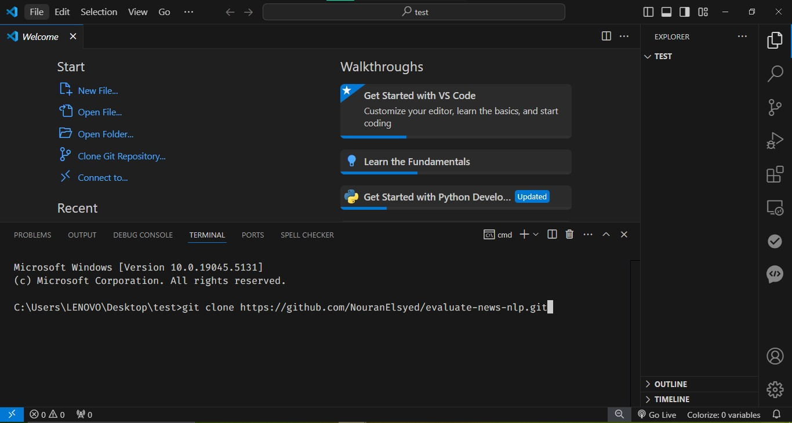
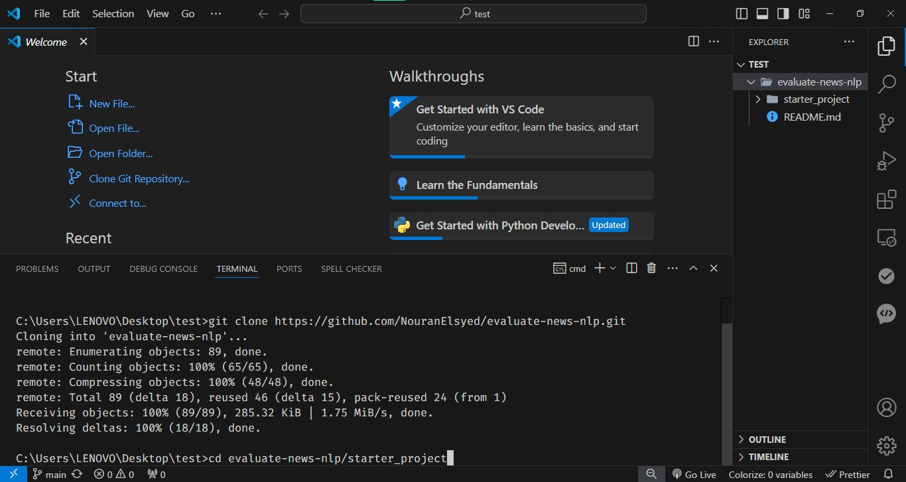
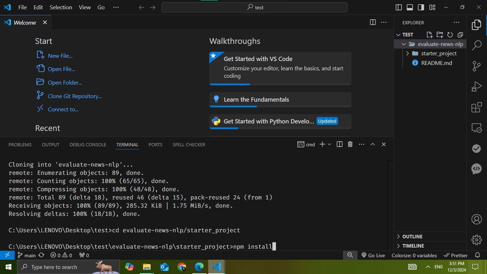
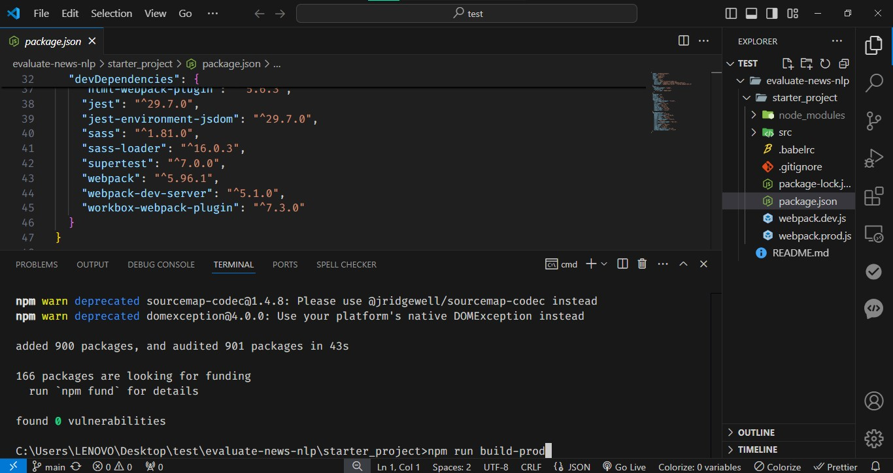
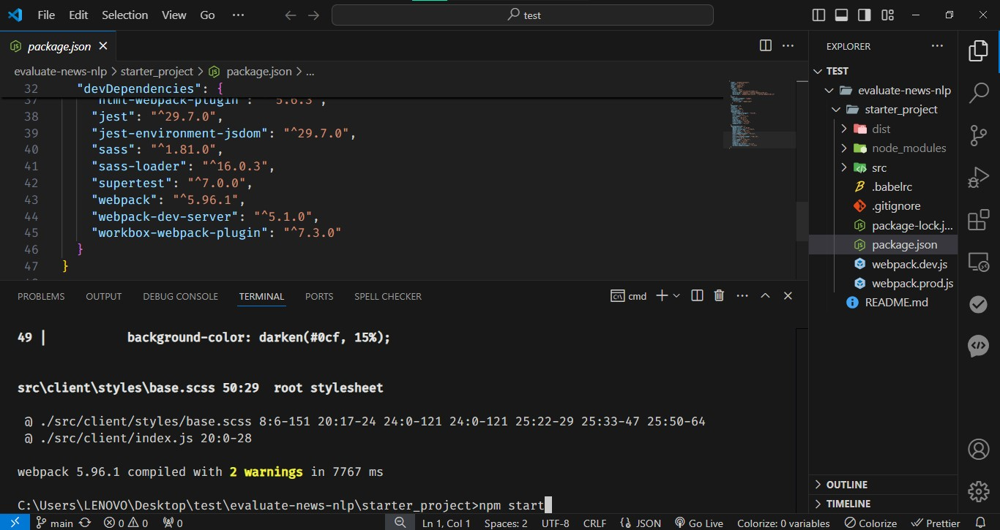
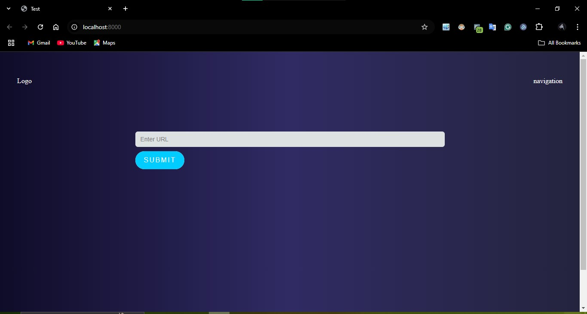

# Evaluate News NLP

This project focuses on evaluating news articles using Natural Language Processing (NLP) techniques. The goal is to analyze, categorize, and provide insights based on news content. 

## Features

- News article classification using machine learning models.
- Sentiment analysis of news articles.
- Named entity recognition (NER) to identify key entities.
- Text preprocessing and feature extraction techniques.

## Installation

Follow these steps to run the application locally:

1. Clone the repository:

   git clone https://github.com/NouranElsyed/evaluate-news-nlp.git

Navigate to the project folder:

    cd evaluate-news-nlp/starter_project

Install the dependencies:

        npm install

##  How to Run
To evaluate news articles, simply run:

    npm run build-prod
    npm start

## Dependencies

 
    clean-webpack-plugin
    cors
    css-loader
    dotenv
    express
    node-fetch
    style-loader
    webpack-cli

## License
This project is licensed under the MIT License - see the LICENSE file for detailS

